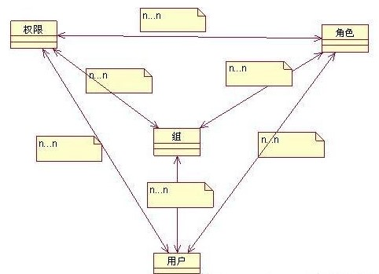
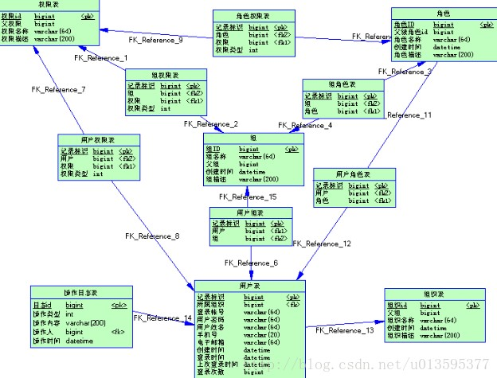

# 目录
- [目录](#%E7%9B%AE%E5%BD%95)
  - [架构](#%E6%9E%B6%E6%9E%84)
  - [子系统实现](#%E5%AD%90%E7%B3%BB%E7%BB%9F%E5%AE%9E%E7%8E%B0)
    - [权限子系统](#%E6%9D%83%E9%99%90%E5%AD%90%E7%B3%BB%E7%BB%9F)
    - [对账子系统](#%E5%AF%B9%E8%B4%A6%E5%AD%90%E7%B3%BB%E7%BB%9F)
  - [问题类型](#%E9%97%AE%E9%A2%98%E7%B1%BB%E5%9E%8B)
    - [一致性问题](#%E4%B8%80%E8%87%B4%E6%80%A7%E9%97%AE%E9%A2%98)
  - [中间件使用场景](#%E4%B8%AD%E9%97%B4%E4%BB%B6%E4%BD%BF%E7%94%A8%E5%9C%BA%E6%99%AF)
    - [缓存](#%E7%BC%93%E5%AD%98)
      - [List](#list)
      - [分布式并发锁](#%E5%88%86%E5%B8%83%E5%BC%8F%E5%B9%B6%E5%8F%91%E9%94%81)
      - [阻塞轮训队列](#%E9%98%BB%E5%A1%9E%E8%BD%AE%E8%AE%AD%E9%98%9F%E5%88%97)
  - [系统类型](#%E7%B3%BB%E7%BB%9F%E7%B1%BB%E5%9E%8B)
    - [计算密集型](#%E8%AE%A1%E7%AE%97%E5%AF%86%E9%9B%86%E5%9E%8B)
    - [I/O密集型](#io%E5%AF%86%E9%9B%86%E5%9E%8B)

===========================================

## 架构

 [⬆ 回到顶部](#目录)

===========================================

## 子系统实现

### 权限子系统

//
> ----------RBAC用户、角色、权限、组设计方案 - ljw499356212的博客 - CSDN博客
> https://blog.csdn.net/ljw499356212/article/details/81055141

//
> ----------RBAC权限管理模型：基本模型及角色模型解析及举例 | 人人都是产品经理
> http://www.woshipm.com/pd/440765.html

-----

//
> ----------Heeexy/SpringBoot-Shiro-Vue: 提供一套基于Spring Boot-Shiro-Vue的权限管理思路.前后端都加以控制,做到按钮/接口级别的权限
> https://github.com/Heeexy/SpringBoot-Shiro-Vue

//
> ----------RBAC新解：基于资源的权限管理(Resource-Based Access Control) - 网夫子 - ITeye博客
> https://globeeip.iteye.com/blog/1236167

-----

//
> ----------RBAC权限管理模型：基本模型及角色模型解析及举例 | 人人都是产品经理
> http://www.woshipm.com/pd/440765.html
六、基于RBAC的延展——用户组
解析：

基于RBAC模型，还可以适当延展，使其更适合我们的产品。譬如增加用户组概念，直接给用户组分配角色，再把用户加入用户组。这样用户除了拥有自身的权限外，还拥有了所属用户组的所有权限。

举例：

譬如，我们可以把一个部门看成一个用户组，如销售部，财务部，再给这个部门直接赋予角色，使部门拥有部门权限，这样这个部门的所有用户都有了部门权限。用户组概念可以更方便的给群体用户授权，且不影响用户本来就拥有的角色权限。

 [⬆ 回到顶部](#目录)

### 对账子系统

//
> ----------美团配送资金安全治理之对账体系建设 - 美团技术团队
> https://tech.meituan.com/2018/03/21/balance-accounts.html
可以看出，这些都是一些上下游交互的边界场景，以及遇到的问题。当然不仅限于这些场景，凡是有系统交互、数据交互边界的场景，都会出现此类问题，我们称之为“一致性问题”。经粗略统计，我们清结算系统建立以来有70%左右的问题都属于一致性问题。

导致一致性问题的原因有很多，诸如：

幂等、并发控制不当。
基础环境故障：比如网络、数据库、消息中间将发生故障。
其他代码bug。

--
为了系统更加专业化的实现对账、做好对账，我们对支付、清结算等资金领域进行了体系化的调研和学习，并结合业务的自身的特点，总结了一套对账系统构建的思路方法，并基于该思路进行了较完整的系统化实现。

--
1. **问题梳理**

由于数据核对的**目标是发现问题**，那么我们进行数据核对就要从问题出发，首先明确我们要通过对账发现哪些问题，只有这样才能保证数据核对的覆盖度。经过梳理，我们发现在数据流转中过程中数据的不一致问题可以统一归结为三类，分别是漏结、重复结、错结。我们可以从这三个角度去统一进行问题梳理。下面介绍一下这三种错误类型的具体含义。

漏结：发起方有数据，而接收方没有数据。举个例子，目前清结算系统会在订单送达时给骑手结算。如果订单的状态是送达，而没有给骑手生成对应的结算数据。就是一种典型的漏结算场景。
重复结：接收方重复处理。还是上面的例子，如果订单送达，给骑手结算了两次，产生了重复的结算数据，就是重复结算。
错结：发起方和接受方数据不一致。一般会发生在金额和状态两个字段。比如说订单上的数据是用户加小费3元。结算这边只产生了2元的小费结算数据，就是错结。

--
经过总结我们发现，对账的形式无非就是两方比对和自身异常检测两种。两方比对又可以细分为一对一、多对一、一对多。比对方法也主要是分为条目匹配和金额匹配。自身异常检测主要是重复性和异常状态的检测。我们把这些通用的对账逻辑模板化，减少重复的开发工作。

 [⬆ 回到顶部](#目录)

===========================================

## 问题类型

### 一致性问题
//
> ----------美团配送资金安全治理之对账体系建设 - 美团技术团队
> https://tech.meituan.com/2018/03/21/balance-accounts.html
可以看出，这些都是一些上下游交互的边界场景，以及遇到的问题。当然不仅限于这些场景，凡是有系统交互、数据交互边界的场景，都会出现此类问题，我们称之为“一致性问题”。经粗略统计，我们清结算系统建立以来有70%左右的问题都属于一致性问题。

导致一致性问题的原因有很多，诸如：

幂等、并发控制不当。
基础环境故障：比如网络、数据库、消息中间将发生故障。
其他代码bug。
 [⬆ 回到顶部](#目录)

===========================================

## 中间件使用场景

### 缓存

#### List

//
> ----------redis数据的轮询规则探讨（并发访问查询接口的性能问题思考） - lixinyao5281的专栏 - CSDN博客
> https://blog.csdn.net/lixinyao5281/article/details/80885478
经过调查发现引发性能问题的关键在于大量数据库连接请求处于排队中，数据库吞吐容量有限，如果不减少访问请求次数，那么优化SQL或减少查询记录数的有一定效果，但在并发超过一定数量的情况下（比如200）性能问题还是存在着。所以解决该问题的思路是转移数据库的压力，考虑使用缓存来处理大并发请求。这里考虑采用redis缓存来提高读取性能，降低对数据的IO操作。

//
> ----------高并发场景下缓存的常见问题
> https://www.toutiao.com/i6633536075719508487/?iid=59835956289&app=news_article&group_id=6633536075719508487&timestamp=1549073934

//
> ----------爱奇艺的Java缓存之路，你应该知道的缓存进化史！
> https://www.toutiao.com/i6633537772713935373/?iid=59835956289&app=news_article&group_id=6633537772713935373&timestamp=1549073525

#### 分布式并发锁

//
> ----------【redis】基于redis实现分布式并发锁 - 淡丶无欲 - 博客园
> http://www.cnblogs.com/VergiLyn/p/7968094.html
前提, 应用服务是分布式或多服务, 而这些"多"有共同的"redis";
　　(2017-12-04) 笑哭, 写这篇之前一直觉得应该有大神已经写好了, 但未找到. 其实redis官网已经给出了实现(百度、阿里都是用的这套): Redis分布式锁、Distributed locks with Redis
　　java版本的名字叫redisson, 其github: https://github.com/redisson/redisson
　　GitHub: https://github.com/vergilyn/SpringBootDemo

#### 阻塞轮训队列

//
> ----------redis实现阻塞轮训队列 - taozhexuan123的专栏 - CSDN博客
> https://blog.csdn.net/taozhexuan123/article/details/73740234
redis实现队列有数据丢失的风险，在一些不要求高可用的需求里，可以在不引入消息队列的情况下，实现轮训队列。

//
> ----------[Redis]处理定时任务的2种思路 - orangleliu 笔记本 - CSDN博客
> https://blog.csdn.net/orangleliu/article/details/52038092
利用键过期通知
思路： reids 2.8 有一种 键空间通知的机制 Keyspace Notifications (强烈推荐看一遍), 允许客户端去订阅一些key的事件，其中就有 key过期的事件，我们可以把 key名称设置为 task的id等标识(这种方式value的值无法取到，所以只用key来识别任务)，expire设置为计划要执行的时间，然后开启一个客户端来订阅消息过期事件，然后处理task。

当key过期的时候就看到第一个窗口的通知了，订阅的key __keyevent@<db>__:expired 这个格式是固定的，db代表的是数据库的编号，由于订阅开启之后这个库的所有key过期时间都会被推送过来，所以最好单独使用一个数据库来进行隔离。

 [⬆ 回到顶部](#目录)

===========================================

## 系统类型

### 计算密集型

//
> ----------重计算型应用的性能优化实践 | 宁静·致远
> http://fengfu.io/2018/06/27/%E9%87%8D%E8%AE%A1%E7%AE%97%E5%9E%8B%E5%BA%94%E7%94%A8%E7%9A%84%E6%80%A7%E8%83%BD%E4%BC%98%E5%8C%96%E5%AE%9E%E8%B7%B5/
系统介绍
ATPCO系统是Qunar国际机票的运价系统，它通过美国ATPCO公司接收全球近500家航空公司的运价、规则数据进行计算，为上层的机票搜索系统提供运价搜索服务。系统的基础数据主要分为运价、规则、航路等数据，其中运价数据有9000万条，规则数据有1.2亿条，平均每条运价关联20条规则数据。规则数据分为Record 0/1/2/3/6/8六大类，其中Record3数据又包含Category1~Category50几十种子规则，以及Table 900系列的若干表、Category 10下面的各种子表。所以业务规则复杂，数据量大是这个系统的一大特点。

### I/O密集型

 [⬆ 回到顶部](#目录)

-- End --